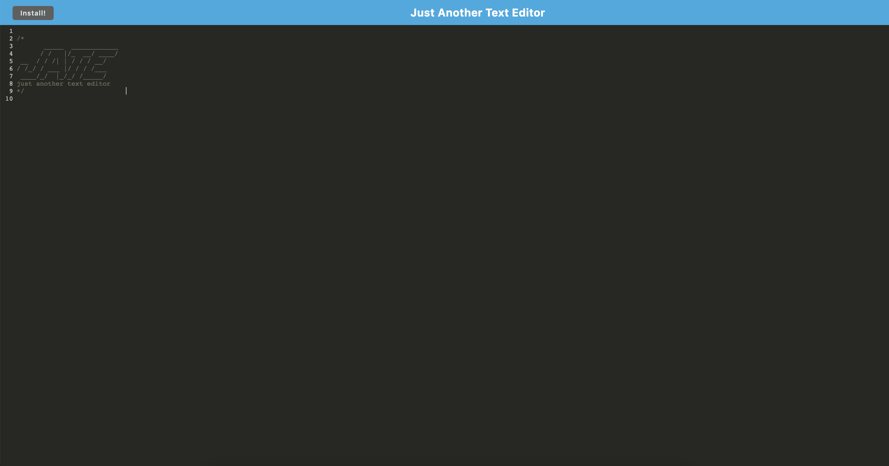

# JATE PWA

## Table of Contents
<a href="#description">Description</a>

<a href="#installation">Installation</a>

<a href="#usage">Usage</a>

<a href="#license">License</a>

<a href="#contributing">Contributing</a>

<a href="#tests">Tests</a>

<a href="#questions">Questions</a>

## Description
This application is a text editor PWA. This application allows a user to write and store text in the application and has the functionality to be downloaded for offline use. Users can type whatever they desire and have their code stored for future use.

## Installation
This project requires Express, Concurrently, Nodemon, Webpack Configs, and Typescript. To install these, simply enter 'npm i' into the integrated terminal at the root folder. In doing so, all the dependencies will be installed for the user at that time.

## Usage
If viewing from the code, the user can enter ‘npm run build’ followed by ‘npm run start:dev’ into the integrated terminal from the root folder to deploy the application. In the deployed application, the user can click the 'Install' button to download the application to use offline.

## License
This application is covered under the MIT license.

## Contributing
Matt Reynolds

## Tests
There are no tests for this repository.

## Questions
MattReynolds53

<a href="https://github.com/MattReynolds53">GitHub Profile Link</a>

If you have further questions, please feel free to email me at mattreynolds53@gmail.com at an appropriate time.

GitHub Repository: https://github.com/MattReynolds53/Text-Editor

Deployed Heroku Link: https://sheltered-brushlands-36545.herokuapp.com/

